# GSM2SIP Android UI 验证报告

报告生成时间：2026-10-05 07:09 UTC。两套 UI smoke 均以各自 `results.json` 为结果依据。

## 验证范围

GitHub Actions Ubuntu KVM 上的 Google Android Emulator API 35 / Android 15，7.6 英寸 Foldable 配置，设备型号 `sdk_gphone64_x86_64`。截图来自真实 KVM Android Emulator 运行，不是 Waydroid。

覆盖未配对界面、权限提示、输入法、横竖屏旋转、模拟折叠/展开和模拟打孔区域。没有真实配对、短信收发或通话，也没有实体折叠屏验收。输入截图中可见的 `.invalid` 地址及 `UI_Smoke` 设备名均为合成测试数据；一次性配对码保持空白。

两端短信备份页面还覆盖密码字段遮罩、JSON/XML 明文提示和实际 Android DocumentsUI 文件选择。合成 SMS Backup & Restore XML 的两条 Unicode 短信经预览、确认导入后在独立只读归档显示；重复导入仍为两条，原图分别记录计数和每条正文的可见状态。未写入系统短信库或产生发送任务。JSON/加密文件格式、错误与回滚另由单元测试验证。

## 运行与来源

| 应用 | 结果 | UI 检查 | source commit | workflow run | 结果时间 |
|---|---:|---:|---|---|---|
| 主机 App | PASS | 34/34 | 1dbf91a27b415244feb823a553f6fbd5687b6949 | [37274365186](https://github.com/KiriKira/gsm2sip-client-android/actions/runs/37274365186) | 2026-10-05T07:02:44.896255+00:00 |
| 网关 App | PASS | 34/34 | 2d6f1565e91f71c9c9cb7d882def2ec33a4cef00 | [37273298410](https://github.com/KiriKira/gsm2sip/actions/runs/37273298410) | 2026-10-05T06:46:06.344853+00:00 |

### 主机附加验证

- Host native instrumentation（workflow run 37274365186）：PASS，19/19 项检查通过。
- Paired fixture（workflow run 37274365186）：PASS，27/27 项检查通过。
- Fixture manifest stages：PASS，10/10 个阶段通过。
- Synthetic scope：synthetic cached offline paired-dashboard UI only; no real pairing, SMS, SIP, or call; synthetic=true, offline_cached_ui_only=true, secrets_excluded=true, airplane_mode_enabled=true, wifi_disabled=true, mobile_data_disabled=true, no_active_validated_network=true.

## 截图记录

### 启动与配对设置

两款应用都进入未配对界面。配对码为空且未输入；主机地址/设备名字段只在后续输入步骤填入合成测试值。

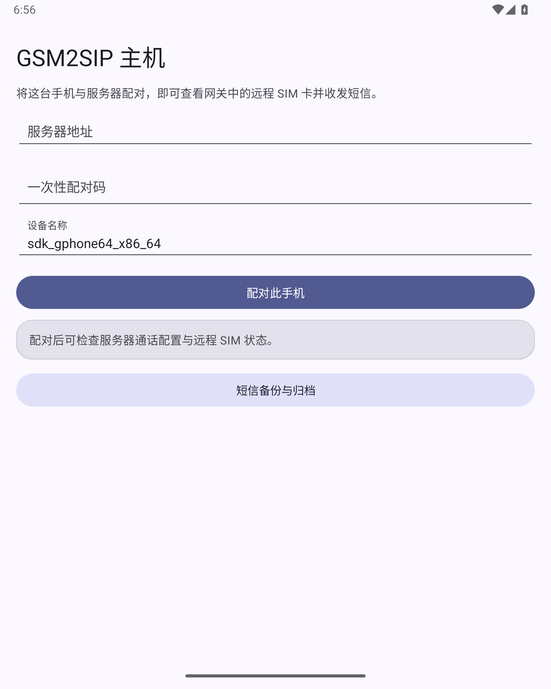

主机 App：主机 App 启动后的未配对表单；服务器地址和一次性配对码均为空。
仓库原图：`images/host-0b54b5b7676f-app_foreground.png`（SHA-256：`0b54b5b7676fc8da9f49fbd5f7175367f050007a1ae5177b7ebab1ff3ff2d8b6`）

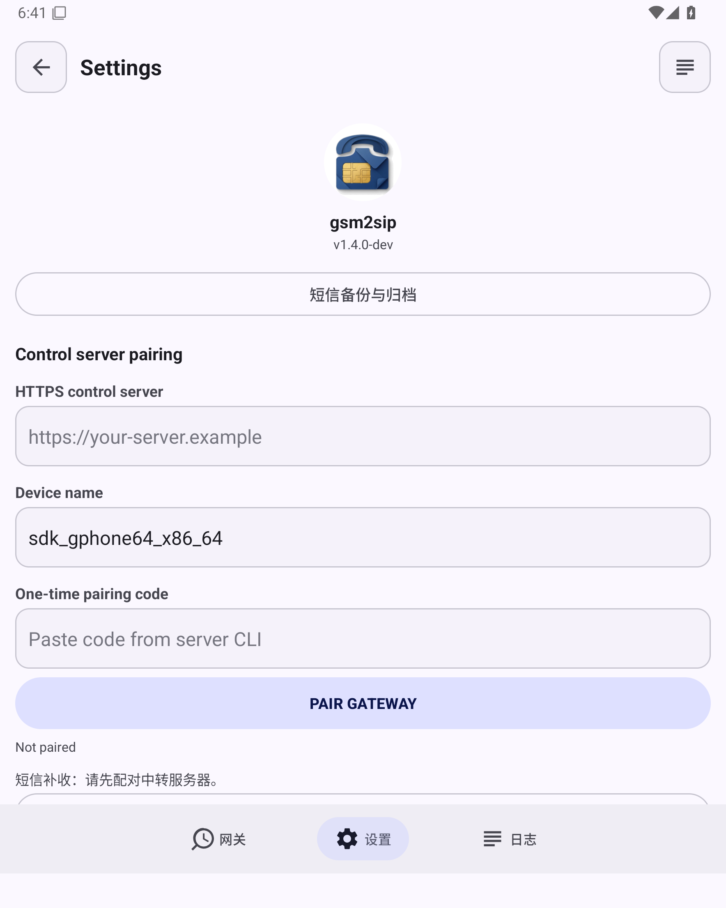

网关 App：网关 App 的 Control server pairing 设置；显示 Not paired，配对码为空。
仓库原图：`images/gateway-43719d91dd96-gateway_control_pairing_form_1791182493.png`（SHA-256：`43719d91dd96b51e31293bec1f1e38d81a32ad8a3f1241ffcb4bbbaddd66013f`）

### 权限提示与拒绝后的状态

网关出现 Android 电话权限提示，运行明确选择拒绝；主机运行未出现权限或默认角色提示，也没有接受权限。

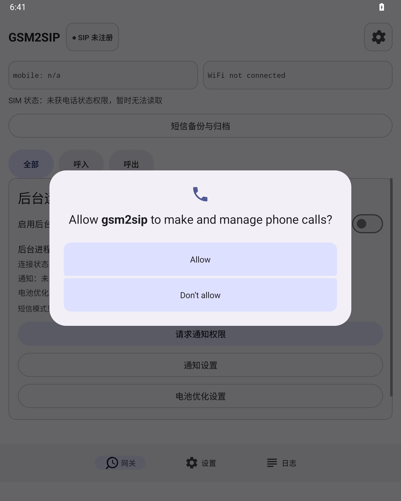

网关 App：网关首次电话权限系统提示；按自动化记录选择了 Don’t allow。
仓库原图：`images/gateway-4256885d1348-permission_prompt_0.png`（SHA-256：`4256885d1348266f0f316183239198a44586613f24b86f0899dd14b911d6e2f3`）

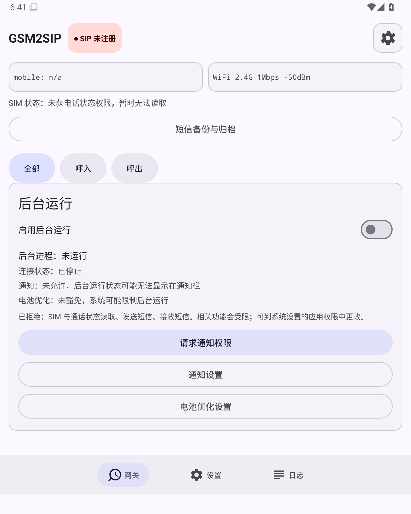

网关 App：拒绝后应用说明 SIM/短信/通话相关功能受限。
仓库原图：`images/gateway-5e02c6f4e47d-after_permission_refusal.png`（SHA-256：`5e02c6f4e47df11a4dc86da668fa75e0fb1a953c5884cdd846a3106b0547244b`）

### 输入法与表单输入

屏幕展示合成输入值及软键盘。测试地址使用 .invalid 保留域名，设备名以 UI_Smoke 开头；没有填写或触碰配对码。

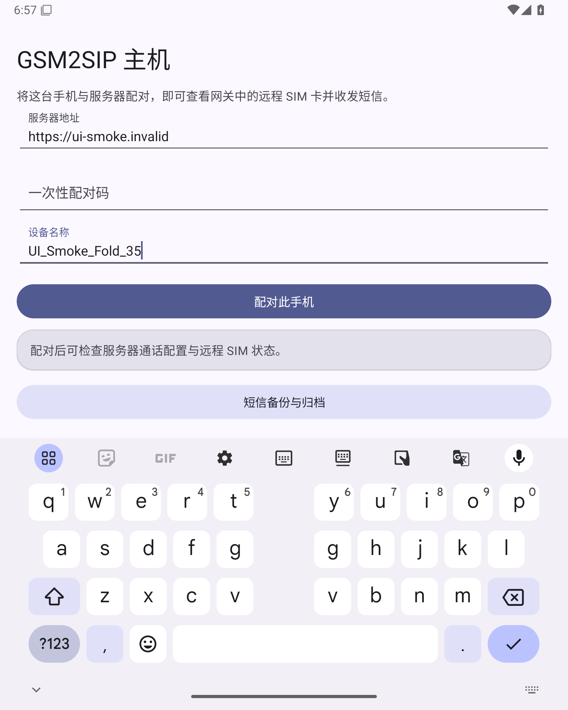

主机 App：主机表单正在输入；软键盘可见，测试地址和设备名已显示。
仓库原图：`images/host-197cff7cccc8-input_before_rotation.png`（SHA-256：`197cff7cccc8dad459cb0e5fbebee0a88c0e913ed496996ea8b1757c0baa297d`）

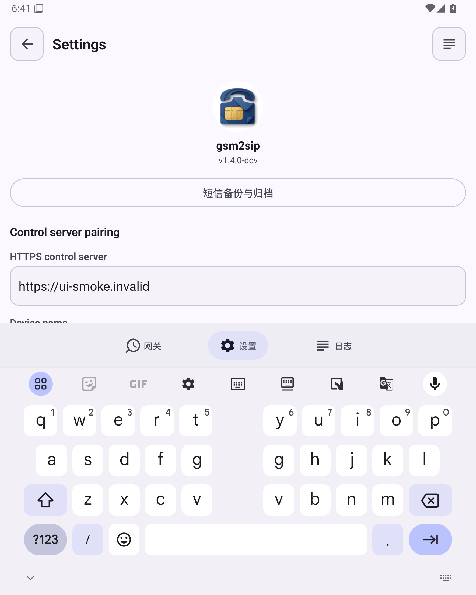

网关 App：网关设置页中服务器地址正在输入；软键盘可见，配对码保持空白。
仓库原图：`images/gateway-cafe011b84a3-server_entered.png`（SHA-256：`cafe011b84a308d2969209dedad4234c44807f8d2a5776d12ed069adc5c3c808`）

### 横屏旋转后的输入状态

横屏截图显示实际旋转后的布局。结果清单确认地址、设备名保留，软键盘重新显示。

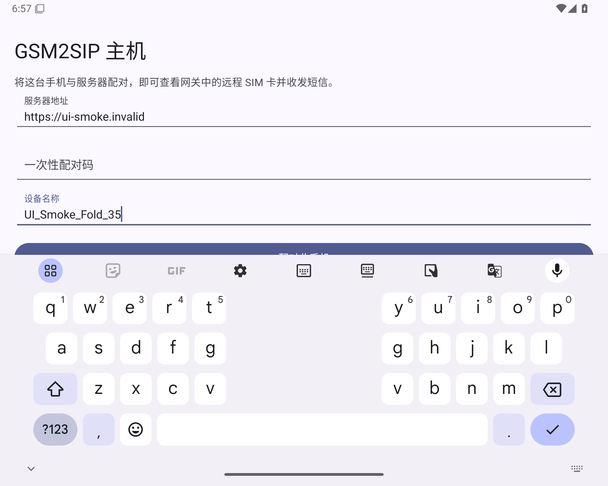

主机 App：主机横屏旋转后；输入内容保留，软键盘恢复。
仓库原图：`images/host-540af4852db8-landscape_after_rotation.png`（SHA-256：`540af4852db89bdbde7529c489b53866b320f1a1e324e4dd0496ed80880a370c`）

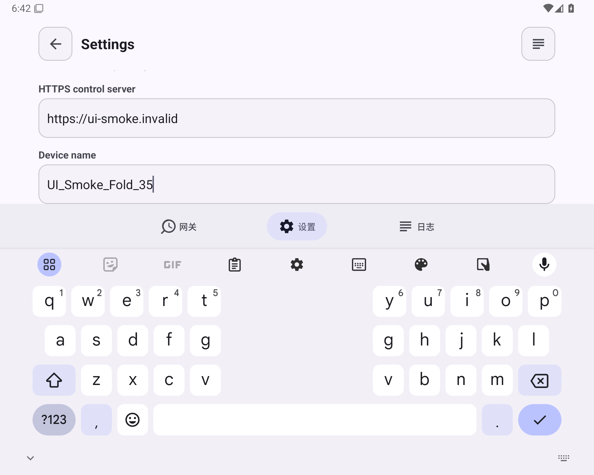

网关 App：网关横屏旋转后；输入内容保留，软键盘恢复。
仓库原图：`images/gateway-f93451258f9c-landscape_after_rotation.png`（SHA-256：`f93451258f9c7dde2cb8476ea439834af6fe38e51cccde0028f6f8f7b6322d16`）

### 竖屏恢复后的输入状态

回到竖屏后，两款应用都保留表单内容并恢复输入法；方向变化由截图尺寸和自动化结果核实。

主机 App：主机回到竖屏；内容与软键盘恢复。
仓库原图：`images/host-51d6fea8e053-after_portrait_rotation.png`（SHA-256：`51d6fea8e053085f3134c0ecbda4f1ca9998380919046d78aa385b86c39ca628`）

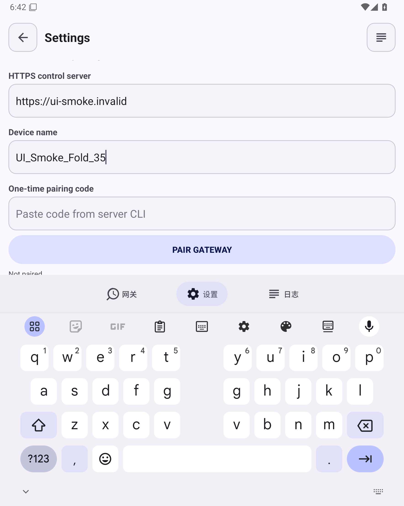

网关 App：网关回到竖屏；内容与软键盘恢复。
仓库原图：`images/gateway-1ad1de70085a-after_portrait_rotation.png`（SHA-256：`1ad1de70085a85463bad5852d6aeaba9a5ff07ecf49950fca2b445cf84fdc82a`）

### 折叠状态

KVM 中的可折叠模拟设备状态从 OPENED 切换到 CLOSED；两应用的输入字段仍可见，结果清单确认输入值保留。

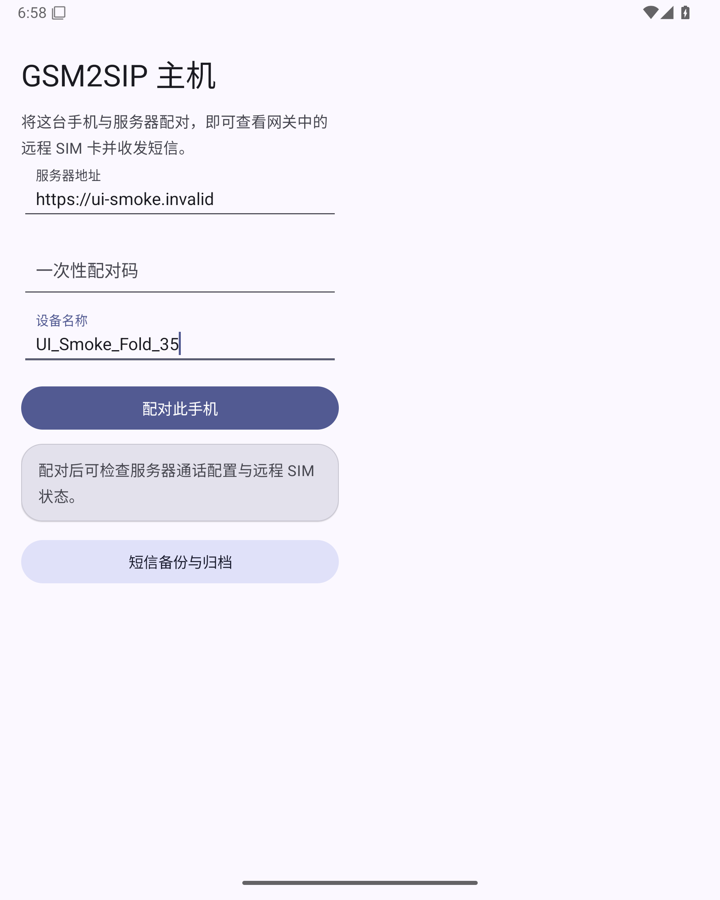

主机 App：主机应用在模拟 CLOSED 折叠状态下的界面。
仓库原图：`images/host-809e7c08512c-folded_ui.png`（SHA-256：`809e7c08512c8de6551f24d791267703bd6e49db4947a1ad2230c3440336b52e`）

网关 App：网关应用在模拟 CLOSED 折叠状态下的界面。
仓库原图：`images/gateway-5211552dfcab-folded_ui.png`（SHA-256：`5211552dfcab489ff6f6e6013fb8f7ad9ba4e4f7d8a458f17532ac8e96181ff7`）

### 展开状态

设备状态恢复为 OPENED；两应用继续显示原有输入值。该结果说明模拟器状态切换，不代表实体折叠屏验收。

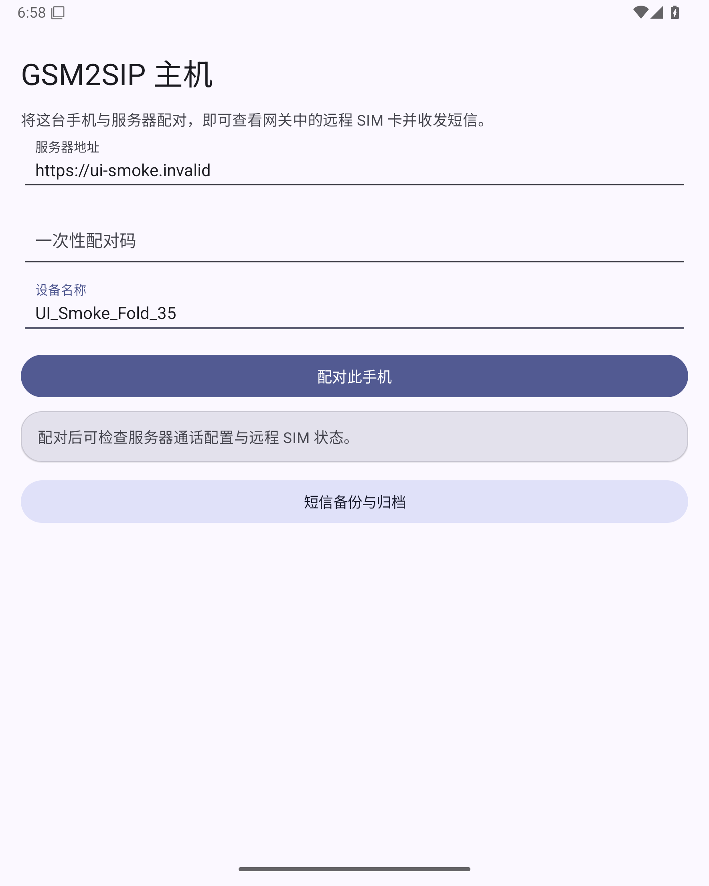

主机 App：主机应用在模拟 OPENED 展开状态下的界面。
仓库原图：`images/host-5f57701821b7-unfolded_ui.png`（SHA-256：`5f57701821b7a53ee5f1d40d926d3f367b2c32df3157d9ff604e3c04b20f8eba`）

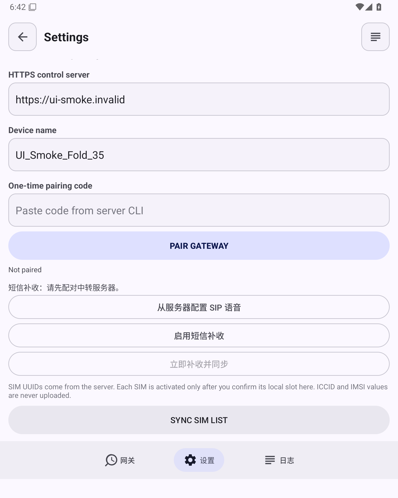

网关 App：网关应用在模拟 OPENED 展开状态下的界面。
仓库原图：`images/gateway-331acae1dc59-unfolded_ui.png`（SHA-256：`331acae1dc597779435060ffe2fdf3568a6e0cf9fd7b4bf5f6d1c7a747b890b3`）

### 打孔安全区域

系统模拟左上角 (0, 0, 136, 136) 打孔区域；几何检查确认当前视口内的可见按钮没有与该区域相交；具体数量记录在各自的 results.json。

主机 App：主机应用启用模拟打孔区域后的界面。
仓库原图：`images/host-0b5dad9cdb74-hole_cutout_enabled.png`（SHA-256：`0b5dad9cdb74103e6599a2fd259c8426013f035374b0de9de22e5c3cf5fb9984`）

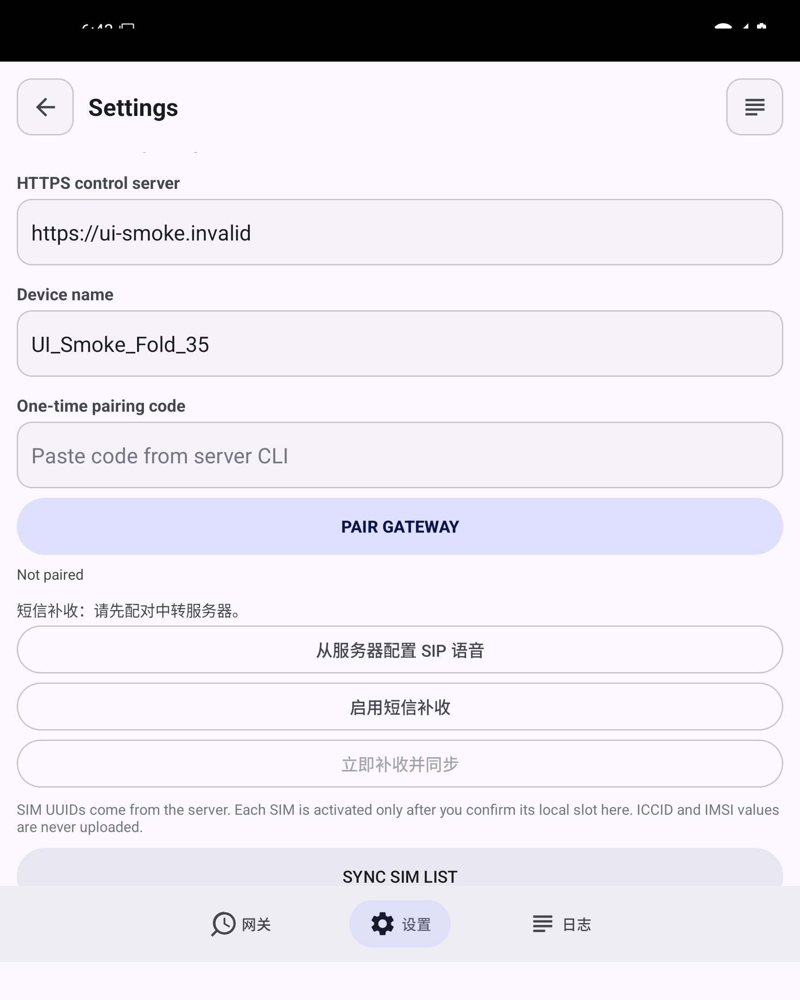

网关 App：网关应用启用模拟打孔区域后的界面。
仓库原图：`images/gateway-258fcb7a5a5b-hole_cutout_enabled.png`（SHA-256：`258fcb7a5a5b287da117da71ba67ea5a252845aff672086286d9a2ff164991af`）

### 缓存配对界面：网关概览与主机列表

以下页面来自 fixture manifest 标记的 synthetic_cached_offline_paired_ui：Airplane mode 已开，Wi-Fi 与移动数据已关、没有有效的已验证网络，服务端占位主机为 ui-smoke.invalid。所有状态是缓存合成 UI；不代表真实配对、真实收发 SMS、后台网络接收、SIP 注册或实际呼叫。

主机 App：离线 fixture 注入的缓存网关概览；这是合成 UI 状态，不代表在线服务。
仓库原图：`images/host-18c3a2eb838c-paired_dashboard_top.png`（SHA-256：`18c3a2eb838cb4a5c76d646d725984270da71fc29078bebfd52aeb89699c3d88`）

主机 App：离线 fixture 中的缓存主机列表；名称与状态均为合成数据。
仓库原图：`images/host-18c3a2eb838c-paired_hosts_cached.png`（SHA-256：`18c3a2eb838cb4a5c76d646d725984270da71fc29078bebfd52aeb89699c3d88`）

### 缓存短信界面：收件箱与编辑页

以下页面来自 fixture manifest 标记的 synthetic_cached_offline_paired_ui：Airplane mode 已开，Wi-Fi 与移动数据已关、没有有效的已验证网络，服务端占位主机为 ui-smoke.invalid。所有状态是缓存合成 UI；不代表真实配对、真实收发 SMS、后台网络接收、SIP 注册或实际呼叫。

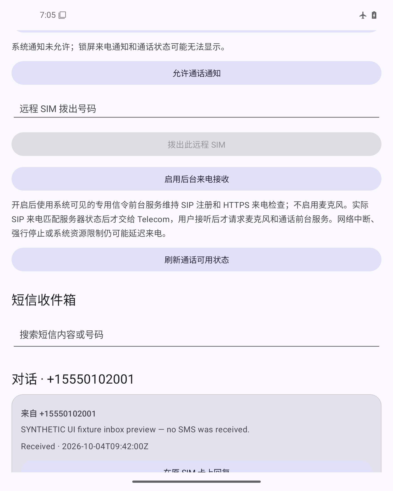

主机 App：缓存短信收件箱样例；没有访问短信网络或执行真实接收。
仓库原图：`images/host-091cd05bc617-sms_inbox.png`（SHA-256：`091cd05bc617fccafdea779cd266eeabdb71aad632e82d11ab060d87fe6fe6e9`）

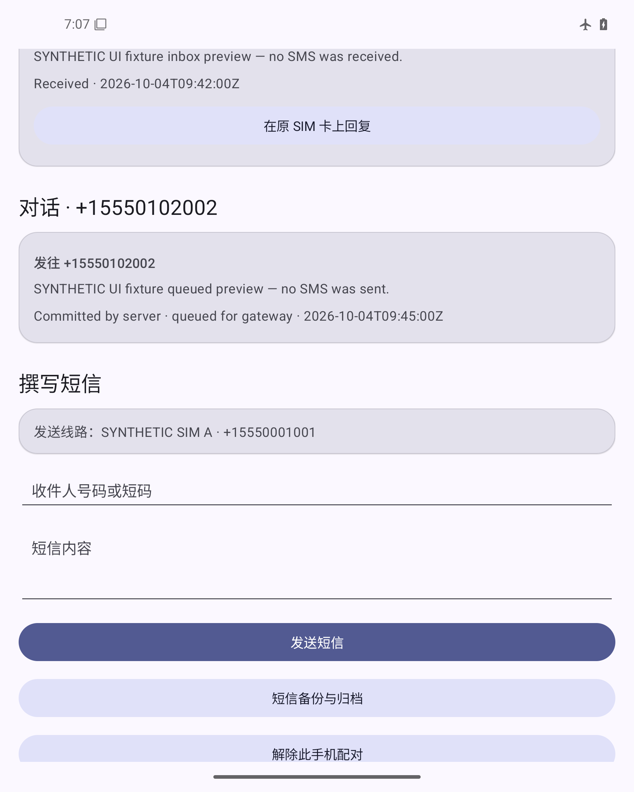

主机 App：短信编辑界面样例；只展示 UI，没有发送真实短信。
仓库原图：`images/host-70f7bb08ba6d-sms_compose.png`（SHA-256：`70f7bb08ba6d4659a510ca0c2d4a380651fba8c9e652ff212df041358670b4dd`）

### 折叠与展开状态中的缓存主机列表

以下页面来自 fixture manifest 标记的 synthetic_cached_offline_paired_ui：Airplane mode 已开，Wi-Fi 与移动数据已关、没有有效的已验证网络，服务端占位主机为 ui-smoke.invalid。所有状态是缓存合成 UI；不代表真实配对、真实收发 SMS、后台网络接收、SIP 注册或实际呼叫。

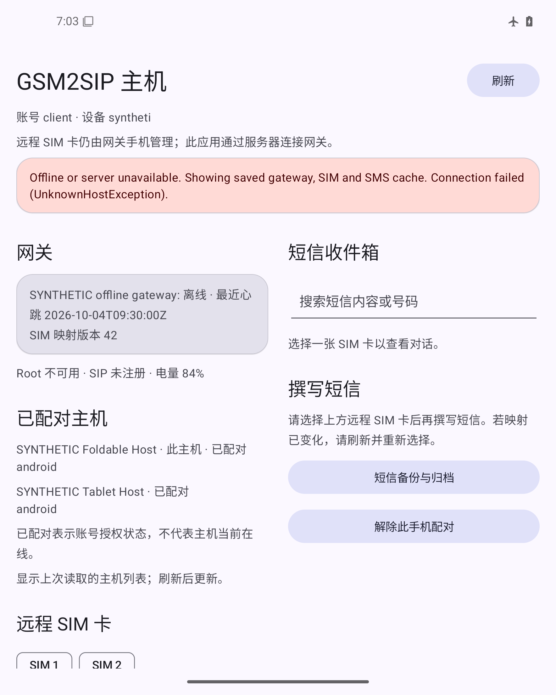

主机 App：模拟 CLOSED 折叠状态下的缓存主机列表；只验证离线合成界面状态。
仓库原图：`images/host-f3f05118eb96-paired_hosts_folded.png`（SHA-256：`f3f05118eb96d9008124380e384425fa8fe173c3d62e04cf43265bdc7e2c907b`）

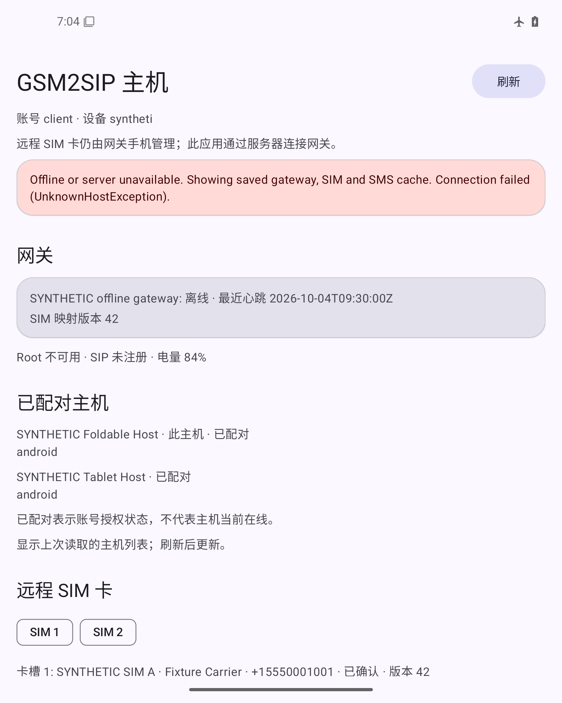

主机 App：恢复 OPENED 展开状态后的缓存主机列表；只验证离线合成界面状态。
仓库原图：`images/host-50d3f371359a-paired_hosts_unfolded.png`（SHA-256：`50d3f371359a556675a37618173503b200a0b60b93840a453f6197951f17af1b`）

### 后台接收设置（本地 UI）

以下页面来自 fixture manifest 标记的 synthetic_cached_offline_paired_ui：Airplane mode 已开，Wi-Fi 与移动数据已关、没有有效的已验证网络，服务端占位主机为 ui-smoke.invalid。所有状态是缓存合成 UI；不代表真实配对、真实收发 SMS、后台网络接收、SIP 注册或实际呼叫。

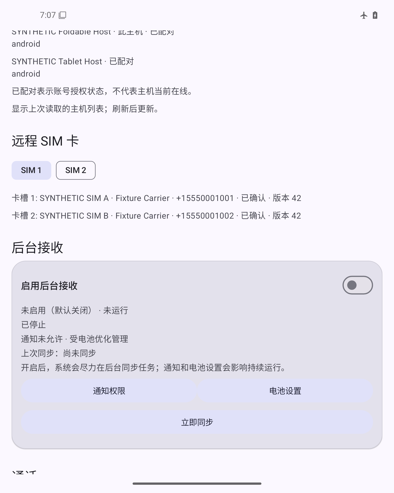

主机 App：后台接收设置界面；这里只验证本地 UI 状态，没有运行网络后台任务。
仓库原图：`images/host-3a9902a6e5fa-background_receive_settings.png`（SHA-256：`3a9902a6e5faf4d018286ad2862b5c7dd1559c2ef36fd6e7b9ee39b69151961c`）

### 通话不可用与禁用的拨号按钮

以下页面来自 fixture manifest 标记的 synthetic_cached_offline_paired_ui：Airplane mode 已开，Wi-Fi 与移动数据已关、没有有效的已验证网络，服务端占位主机为 ui-smoke.invalid。所有状态是缓存合成 UI；不代表真实配对、真实收发 SMS、后台网络接收、SIP 注册或实际呼叫。

主机 App：通话入口显示不可用状态；离线 fixture 阶段没有建立 SIP 或发起通话。
仓库原图：`images/host-92b3622cc235-call_panel_unavailable.png`（SHA-256：`92b3622cc235213105a0aa5e5e4b88d22c897fe9aeed2d04c698c7fca3332202`）

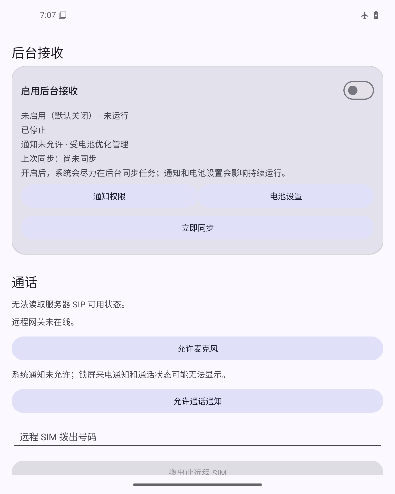

主机 App：单独滚动到拨号控件；确切远程 SIM 拨号按钮可见并处于禁用状态，没有发起通话。
仓库原图：`images/host-92b3622cc235-call_controls_disabled.png`（SHA-256：`92b3622cc235213105a0aa5e5e4b88d22c897fe9aeed2d04c698c7fca3332202`）

### 缓存短信发送预览

以下页面来自 fixture manifest 标记的 synthetic_cached_offline_paired_ui：Airplane mode 已开，Wi-Fi 与移动数据已关、没有有效的已验证网络，服务端占位主机为 ui-smoke.invalid。所有状态是缓存合成 UI；不代表真实配对、真实收发 SMS、后台网络接收、SIP 注册或实际呼叫。

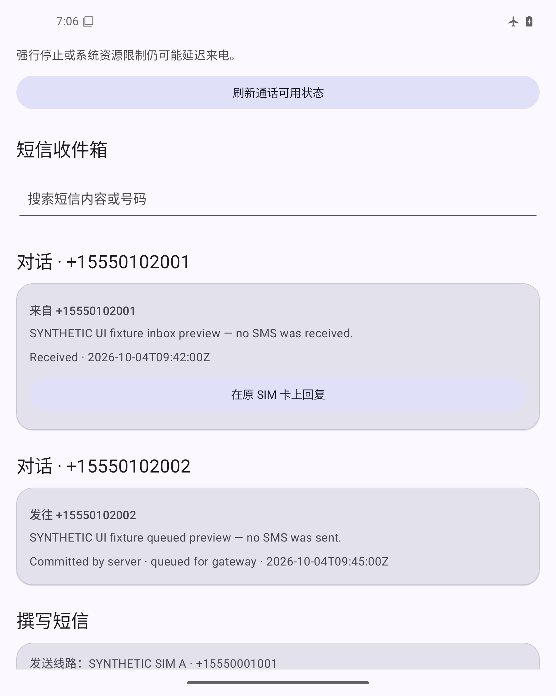

主机 App：队列中的合成短信预览；只展示本地 UI，没有提交或发送短信。
仓库原图：`images/host-0ad502c83b12-sms_outbound_preview.png`（SHA-256：`0ad502c83b124345e2f24bf4478b1c8639a433ba5bf025b61a3f15fd5268d5c3`）

### 主机 App的短信备份入口

从主界面的短信备份与归档按钮进入独立备份页面，未配对时也可以使用导入归档。

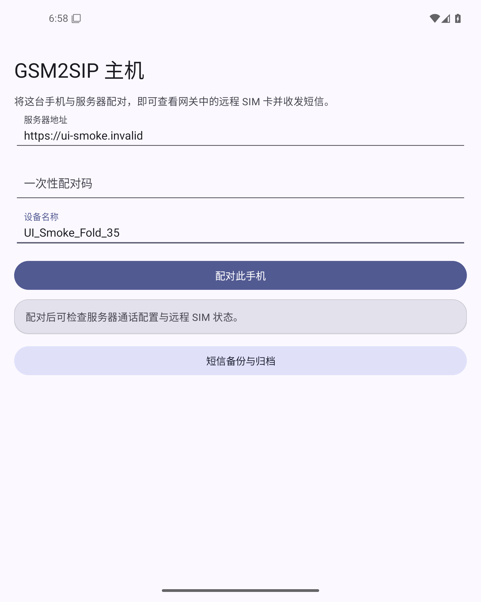

主机 App：主界面的短信备份与归档入口。
仓库原图：`images/host-6dfa770544b4-main-backup-entry-host.png`（SHA-256：`6dfa770544b43933f86cf273d3ca0b842be87dcdd30a4b2473211e41e4939881`）

### 网关 App的短信备份入口

从主界面的短信备份与归档按钮进入独立备份页面，未配对时也可以使用导入归档。

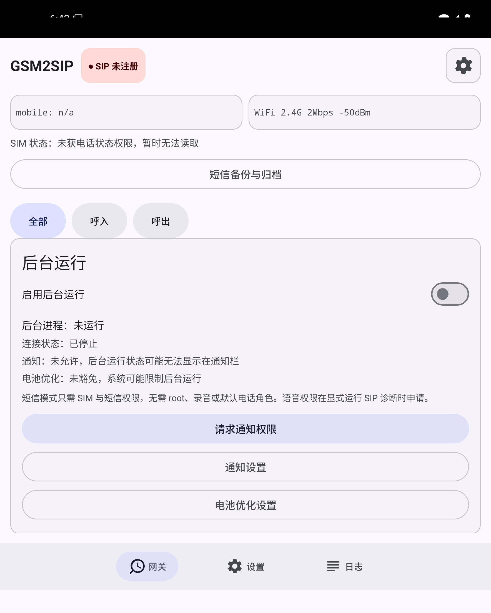

网关 App：主界面的短信备份与归档入口。
仓库原图：`images/gateway-ae4f050ca09a-main-backup-entry-gateway.png`（SHA-256：`ae4f050ca09a2ddef9090e7b969a56af1b2dd90ead73088bb5a6ff156340245c`）

### 短信备份入口与格式

显示加密备份、JSON、SMS Backup & Restore XML 和导入预览入口。该截图证明界面显示，文件 round trip 与回滚另外由自动化测试验证。

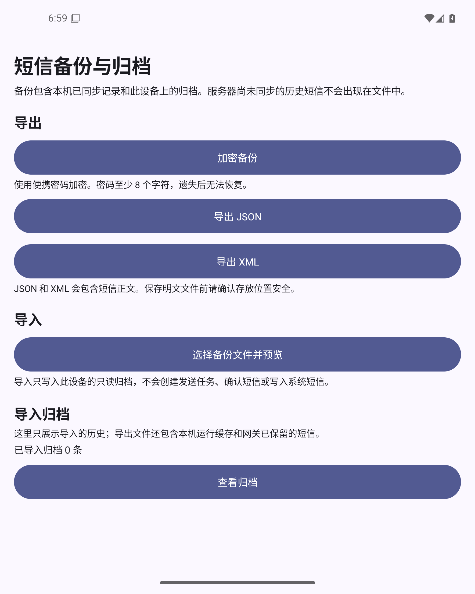

主机 App：主机 App：短信备份入口与格式。
仓库原图：`images/host-68c4b2ada7ba-backup-overview.png`（SHA-256：`68c4b2ada7bae8299f3d4890d017f9e2008c2fba21b9129903e462cf31f28d25`）

网关 App：网关 App：短信备份入口与格式。
仓库原图：`images/gateway-c268a5b7261c-backup-overview.png`（SHA-256：`c268a5b7261c86acda30267e0a52e4e0f0a6a18333527373b1b60838a0fadbbf`）

### 加密备份密码弹窗

密码只保存在当前操作内存中；截图使用未填写的密码框，不包含真实密码。

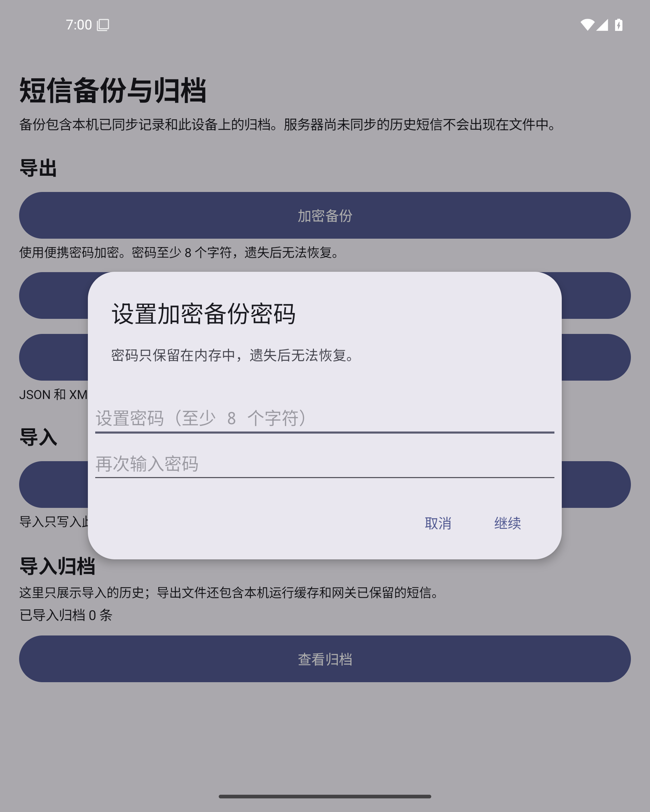

主机 App：主机 App：加密备份密码弹窗。
仓库原图：`images/host-016f3a0fa5c7-backup-password.png`（SHA-256：`016f3a0fa5c77fc182705f7d7c17fe5e0e38972580ee82cee7684cc71a1693c6`）

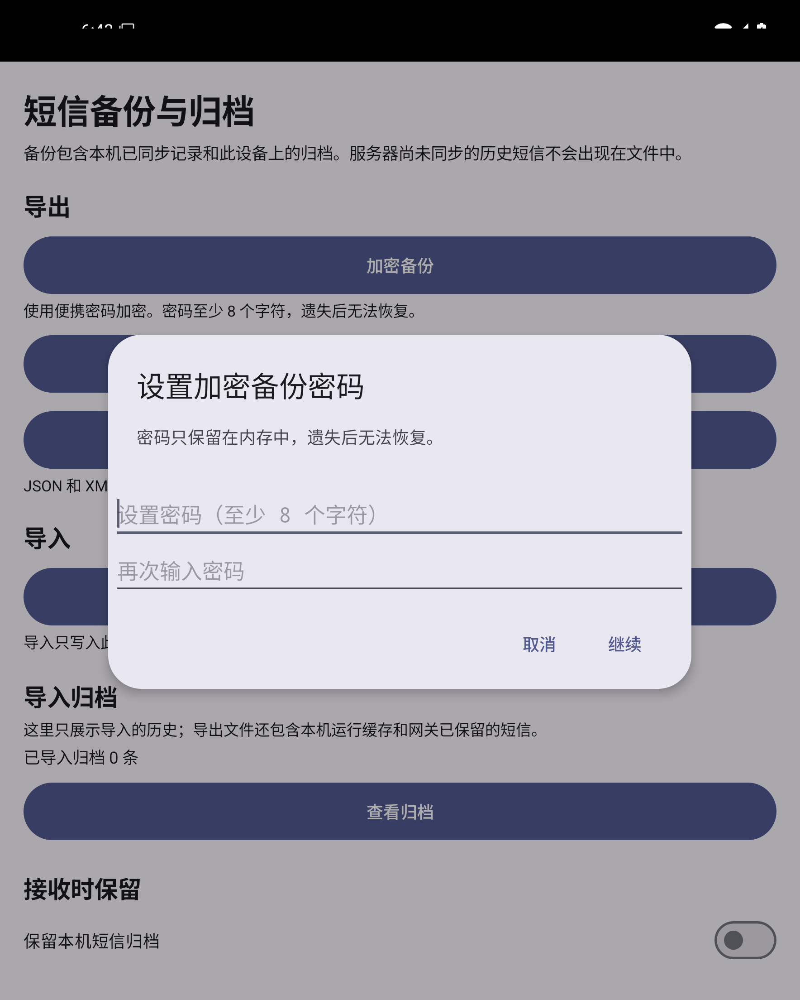

网关 App：网关 App：加密备份密码弹窗。
仓库原图：`images/gateway-5fcf29470f0c-backup-password.png`（SHA-256：`5fcf29470f0cb3ba20eb5e0df155e11fe096f02e162abb80433ea8983b06e180`）

### JSON 明文导出确认

明文 JSON 导出前显示正文与号码暴露提示；此次界面验证取消导出，文件格式由单元测试验证。

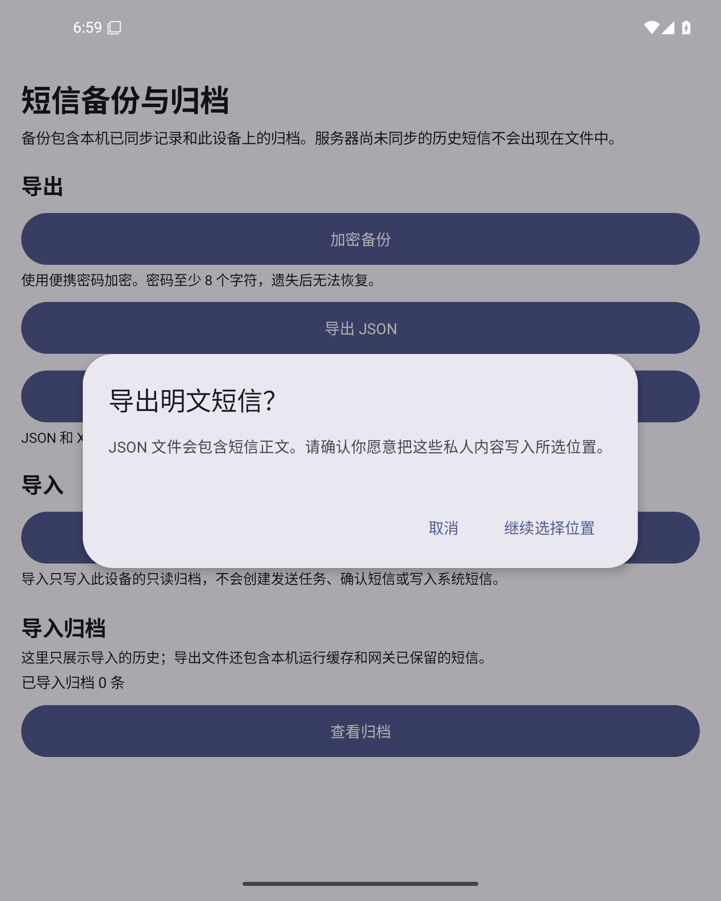

主机 App：主机 App：JSON 明文导出确认。
仓库原图：`images/host-0259312028ff-backup-json-warning.png`（SHA-256：`0259312028ff5bd316a263578a55dfbe49eb9abd4bd518d94edf49623215ea74`）

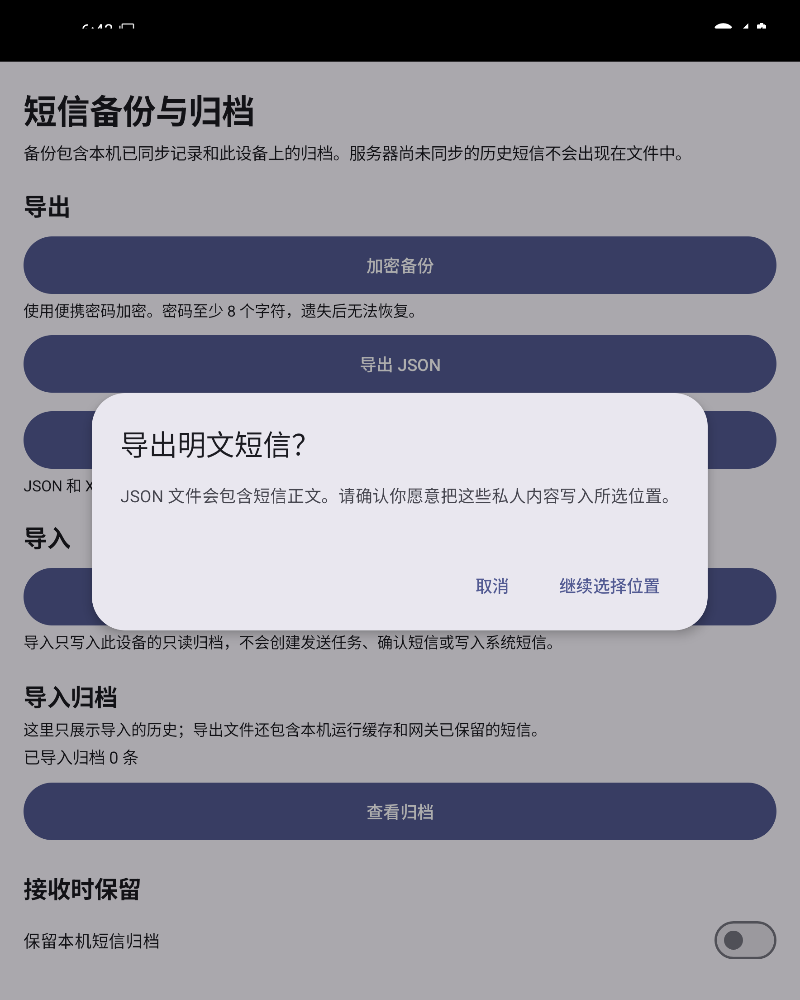

网关 App：网关 App：JSON 明文导出确认。
仓库原图：`images/gateway-ba454d29f5ad-backup-json-warning.png`（SHA-256：`ba454d29f5ad4ede8c996b809475d5654731154dc0df623e1109b2615c1278dc`）

### XML 明文导出确认

SMS Backup & Restore XML 导出前显示明文提示；此次界面验证取消导出。

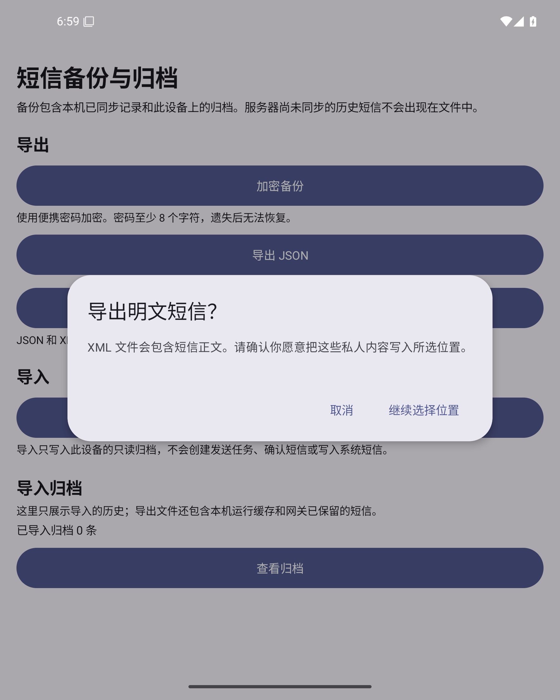

主机 App：主机 App：XML 明文导出确认。
仓库原图：`images/host-bab5750ec0c9-backup-xml-warning.png`（SHA-256：`bab5750ec0c93523d4af8705ba695a99e41035a6ef61f1f64241336d8fab584d`）

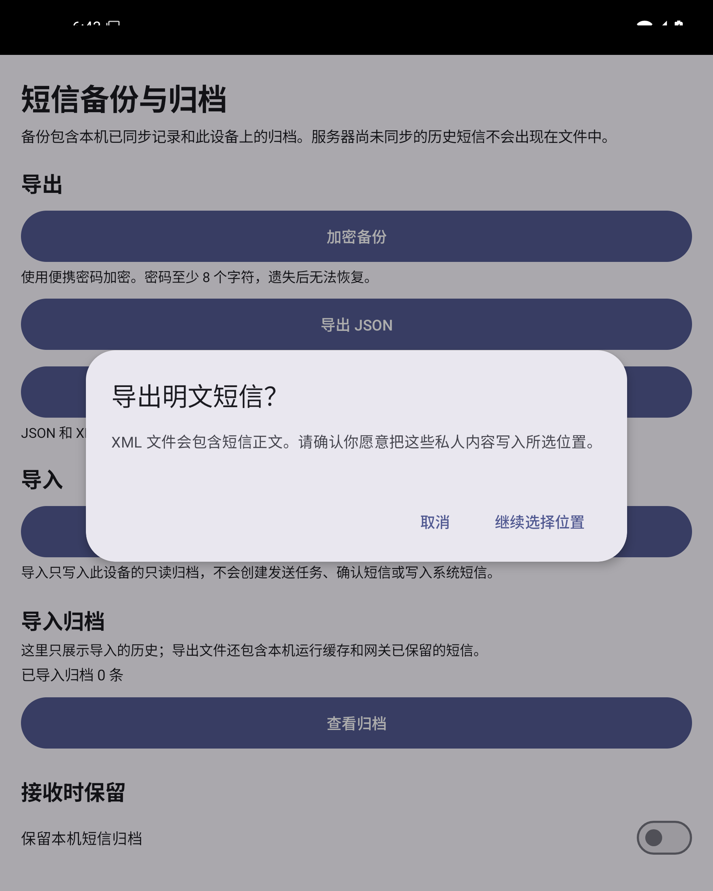

网关 App：网关 App：XML 明文导出确认。
仓库原图：`images/gateway-61bc8a8c2efc-backup-xml-warning.png`（SHA-256：`61bc8a8c2efc96195d96daa945f42bf3ae355414a11efc7c62dd6c9d9058ce39`）

### 实际文件选择与 XML 导入预览

通过 Android DocumentsUI 选择合成 SMS Backup & Restore XML，预览两条入站/出站 Unicode 短信。未写入系统短信库或生成发送任务。

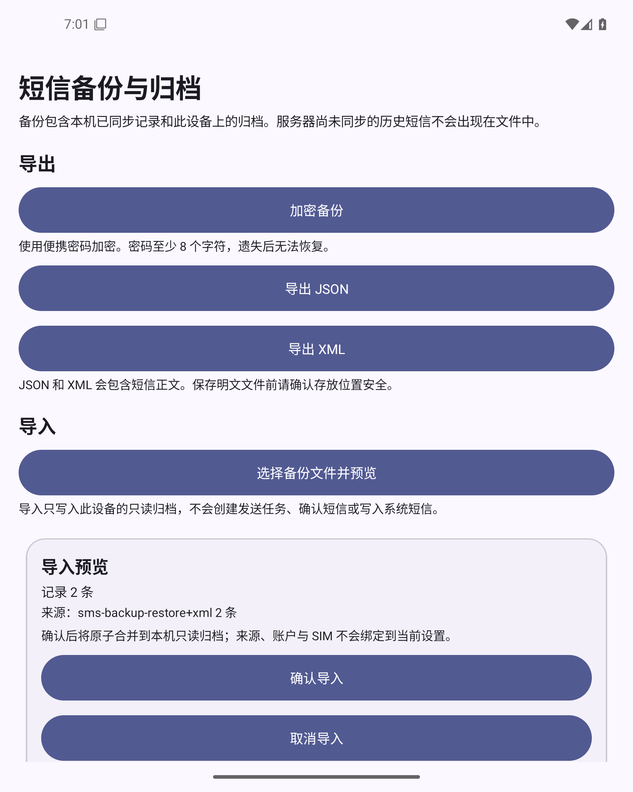

主机 App：主机 App：实际文件选择与 XML 导入预览。
仓库原图：`images/host-8c04b3ba0e64-backup-import-preview.png`（SHA-256：`8c04b3ba0e6411ac6e1af2b488b23a0422b13dbfca6c33c7a24f34c470aa421d`）

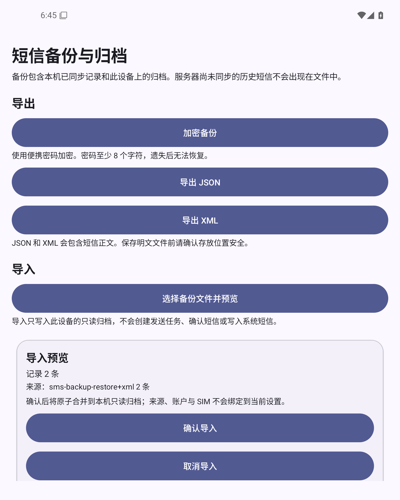

网关 App：网关 App：实际文件选择与 XML 导入预览。
仓库原图：`images/gateway-9e1be30640e5-backup-import-preview.png`（SHA-256：`9e1be30640e5ccac42232a010459ba0a9442c85df10aeb574c53e1202e6c8dce`）

### 导入归档与正文

确认导入后查看独立归档中的合成号码和 Unicode 正文；这些内容是测试数据。

主机 App：主机 App：导入归档与正文。
仓库原图：`images/host-90bc81ba4364-backup-imported-history.png`（SHA-256：`90bc81ba4364ccd7010a7f95c726c55666fb384416e213bc2ecc7d7a56f5f08e`）

网关 App：网关 App：导入归档与正文。
仓库原图：`images/gateway-1e724f4753f2-backup-imported-history.png`（SHA-256：`1e724f4753f2ca225f228acc06092cb15fa5df584c94339e096023c123afd3f6`）

### 归档数量与展开状态

单独确认导入归档数量为两条并已展开；正文位于页面下方，另行滚动查看。

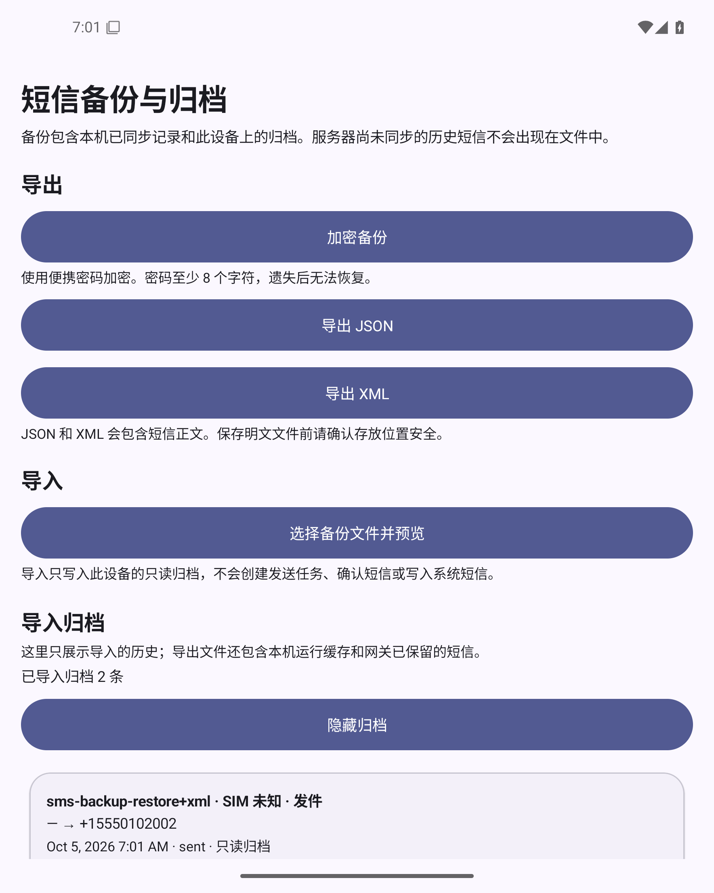

主机 App：主机 App：归档数量与展开状态。
仓库原图：`images/host-725e2211e3c4-backup-imported-history-count.png`（SHA-256：`725e2211e3c4c5b7b3920f609210d624812ecb6a2dd6b58f6fabb42199ca1adb`）

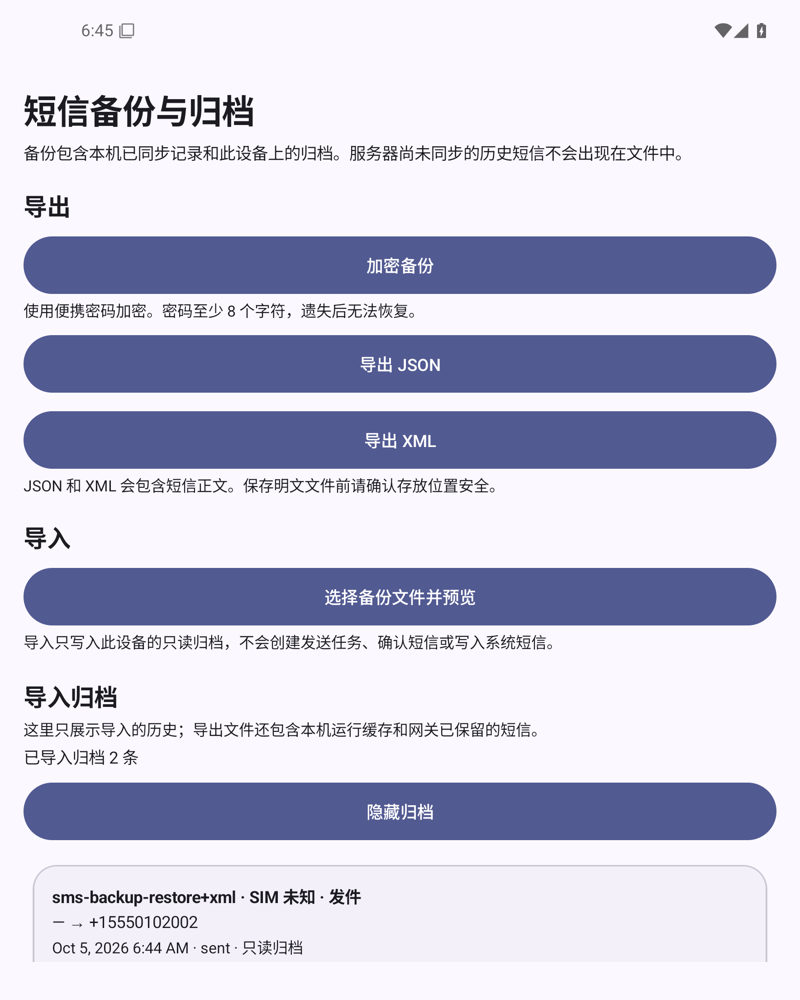

网关 App：网关 App：归档数量与展开状态。
仓库原图：`images/gateway-2d8a788020f4-backup-imported-history-count.png`（SHA-256：`2d8a788020f4e3ab7f98b2a40c98d66a962c466b88ca304dd7d463ba3c8fb0e2`）

### 导入的入站短信正文

滚动到入站记录，检查合成中文与 emoji 正文的实际可见边界。

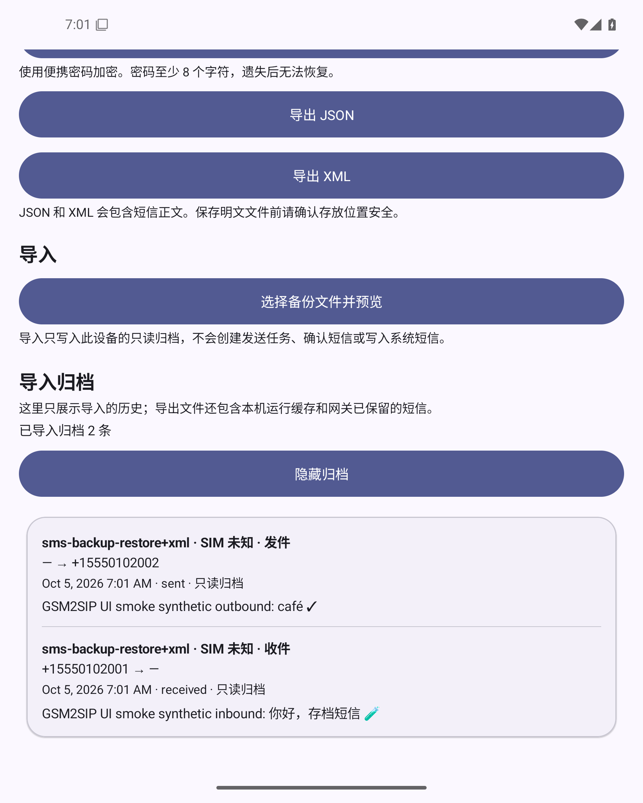

主机 App：主机 App：导入的入站短信正文。
仓库原图：`images/host-35bdf16e042d-backup-imported-history-inbound.png`（SHA-256：`35bdf16e042d79317f9989c795e9b0b27e239b9d2f2d54d9f865212a4767105f`）

网关 App：网关 App：导入的入站短信正文。
仓库原图：`images/gateway-1e724f4753f2-backup-imported-history-inbound.png`（SHA-256：`1e724f4753f2ca225f228acc06092cb15fa5df584c94339e096023c123afd3f6`）

### 导入的出站短信正文

滚动到出站记录，检查 café 与勾号正文的实际可见边界。

主机 App：主机 App：导入的出站短信正文。
仓库原图：`images/host-35bdf16e042d-backup-imported-history-outbound.png`（SHA-256：`35bdf16e042d79317f9989c795e9b0b27e239b9d2f2d54d9f865212a4767105f`）

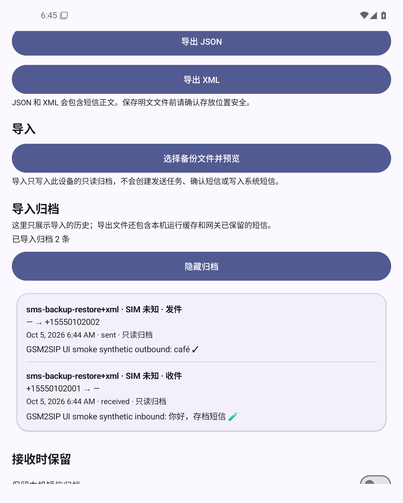

网关 App：网关 App：导入的出站短信正文。
仓库原图：`images/gateway-1e724f4753f2-backup-imported-history-outbound.png`（SHA-256：`1e724f4753f2ca225f228acc06092cb15fa5df584c94339e096023c123afd3f6`）

### 重复导入后的入站记录

重复导入后仍有两条归档，入站正文仍仅出现一次。

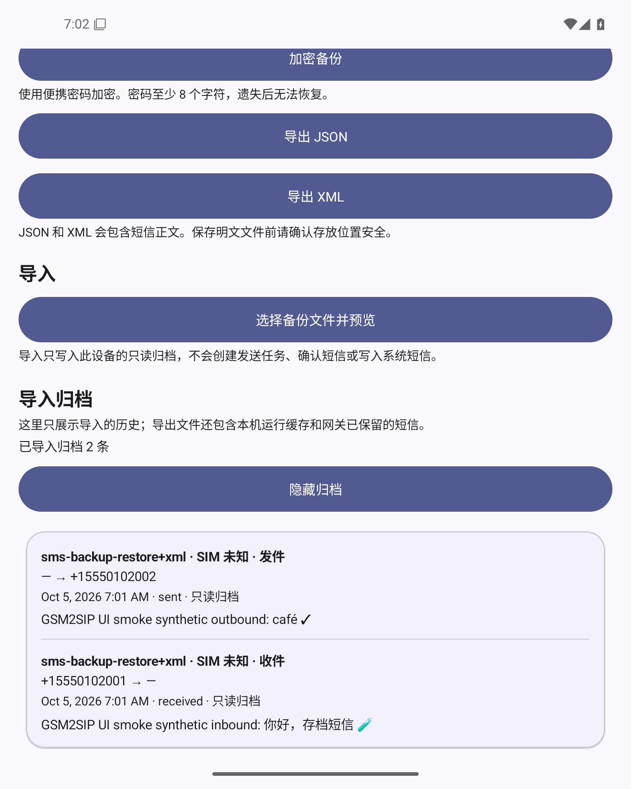

主机 App：主机 App：重复导入后的入站记录。
仓库原图：`images/host-46a318261943-backup-reimported-history-inbound.png`（SHA-256：`46a318261943377353f9d26c15c71d4ca7ec457ddaf0211bc2f33f62bd6f07cd`）

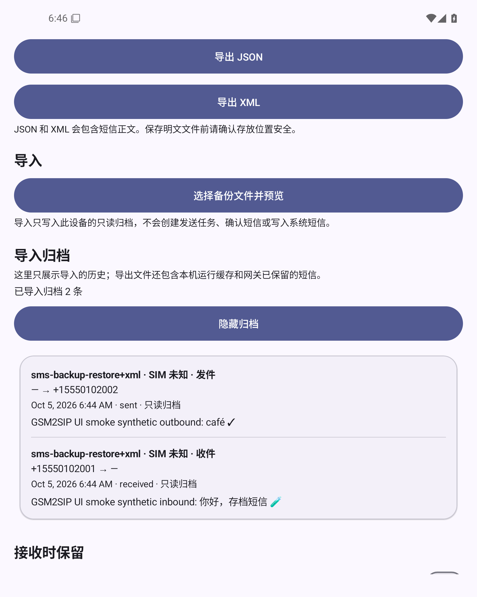

网关 App：网关 App：重复导入后的入站记录。
仓库原图：`images/gateway-fcb3284be0ff-backup-reimported-history-inbound.png`（SHA-256：`fcb3284be0ff60f08f9b9ba7828e3e4724effebc14cc2cbed0eb3463b0e42865`）

### 重复导入后的出站记录

重复导入后出站正文仍仅出现一次；输入 XML fixture 保持完整 Unicode 数据。

主机 App：主机 App：重复导入后的出站记录。
仓库原图：`images/host-46a318261943-backup-reimported-history-outbound.png`（SHA-256：`46a318261943377353f9d26c15c71d4ca7ec457ddaf0211bc2f33f62bd6f07cd`）

网关 App：网关 App：重复导入后的出站记录。
仓库原图：`images/gateway-fcb3284be0ff-backup-reimported-history-outbound.png`（SHA-256：`fcb3284be0ff60f08f9b9ba7828e3e4724effebc14cc2cbed0eb3463b0e42865`）

### 重复文件导入预览

再次选择同一文件，预览仍为两条；自动化检查确认合并后总数保持两条。

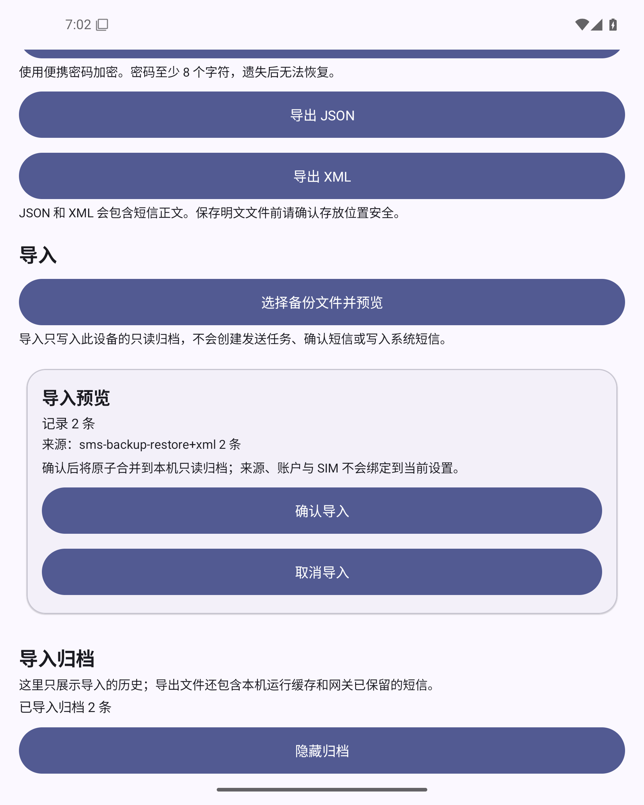

主机 App：主机 App：重复文件导入预览。
仓库原图：`images/host-f456237ef848-backup-import-repeat-preview.png`（SHA-256：`f456237ef848ae0b95872e52b2557c21233af7948e4c28b26bf32bd0dac53a2c`）

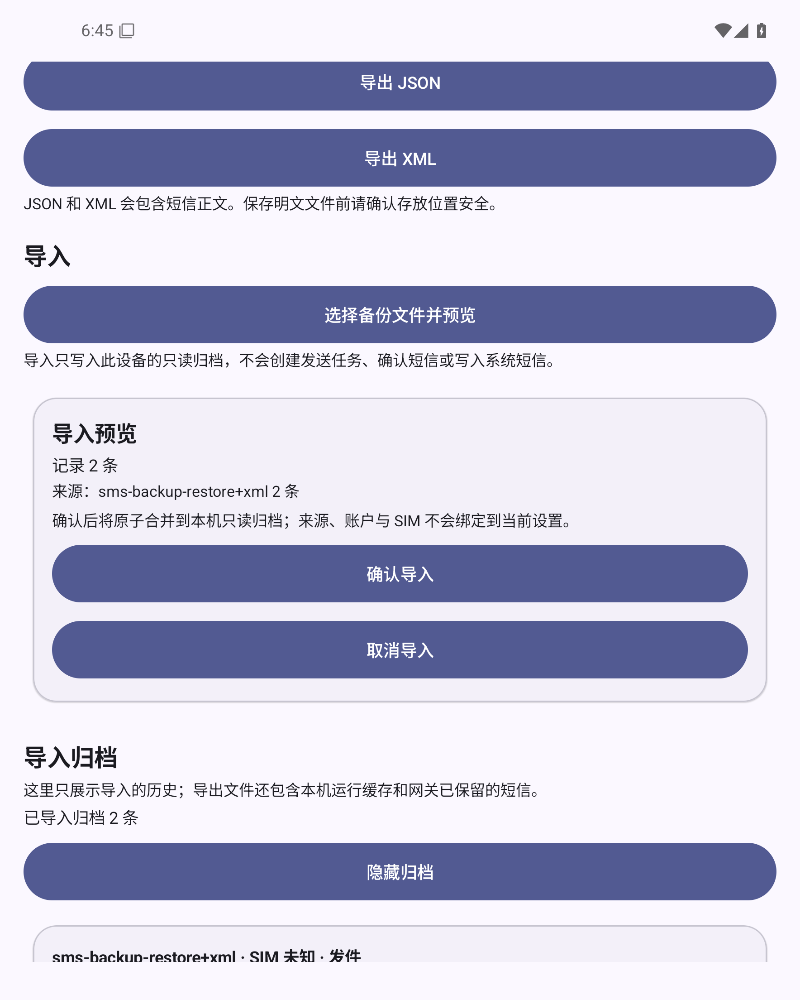

网关 App：网关 App：重复文件导入预览。
仓库原图：`images/gateway-2bd4688bd375-backup-import-repeat-preview.png`（SHA-256：`2bd4688bd375d7c61074e07c19adb43931bd256f990cfa06713d5730a1e37a29`）

### 横屏备份界面

备份页面横屏重建后检查标题及关键按钮的可见边界。

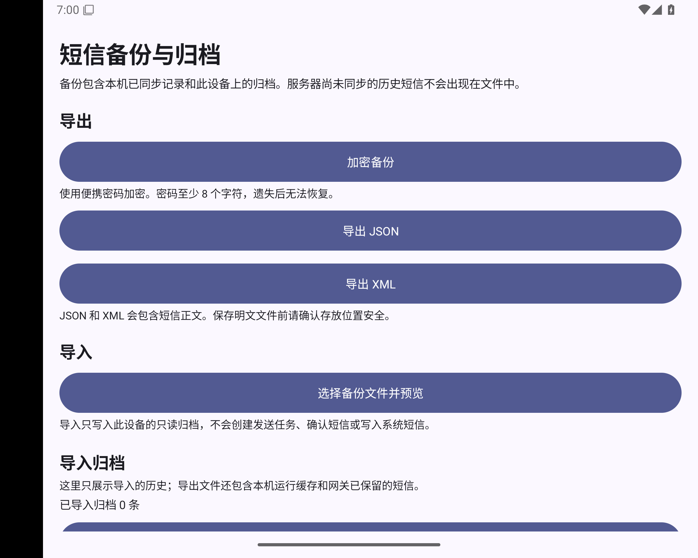

主机 App：主机 App：横屏备份界面。
仓库原图：`images/host-149df2f6b369-backup-rotation-landscape.png`（SHA-256：`149df2f6b369a22ebb4a8e06d918da89302e4fd0faf1899d3ae4c48f31fae720`）

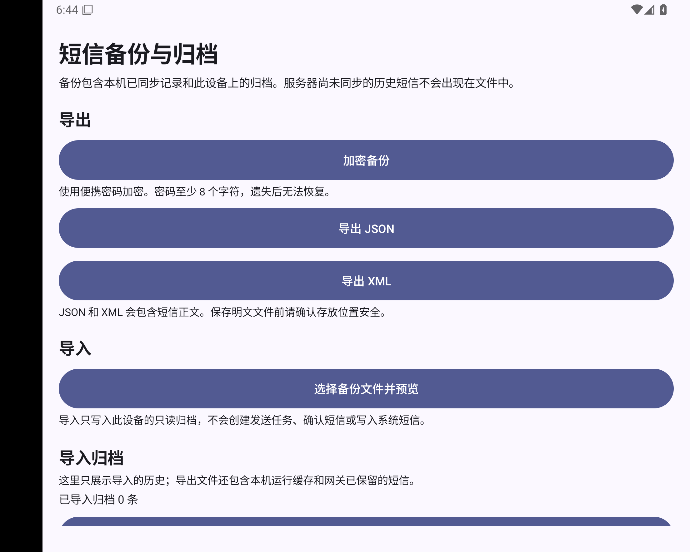

网关 App：网关 App：横屏备份界面。
仓库原图：`images/gateway-00ac978aa3cf-backup-rotation-landscape.png`（SHA-256：`00ac978aa3cf9ac8a0a4a5aa56fc734fa741104cfe49e58c86cc4de85088a6f9`）

### 竖屏备份界面

旋转回竖屏后再次检查关键控件。

主机 App：主机 App：竖屏备份界面。
仓库原图：`images/host-60f457ffd5a1-backup-rotation-portrait.png`（SHA-256：`60f457ffd5a15ab696fca4c9c4912474658ee3d923276388b97ce5c76ec106d4`）

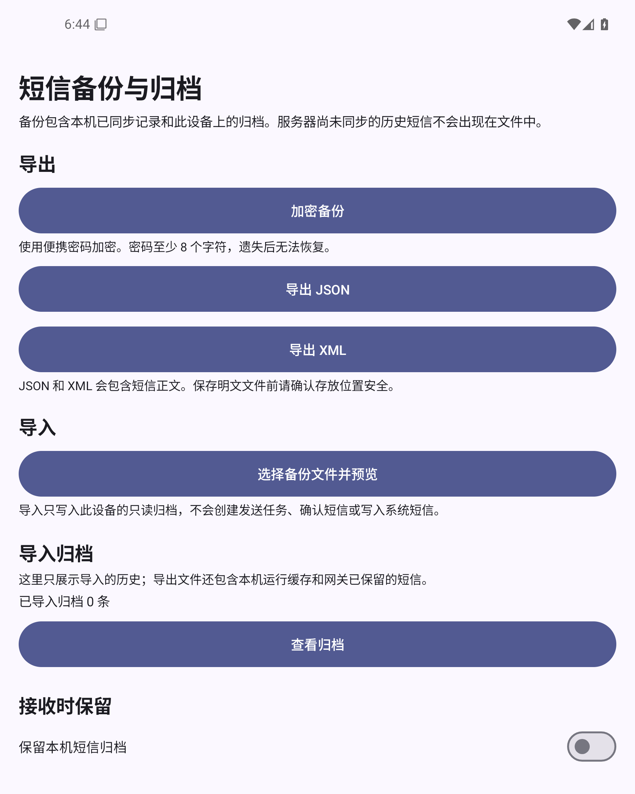

网关 App：网关 App：竖屏备份界面。
仓库原图：`images/gateway-f528e062e086-backup-rotation-portrait.png`（SHA-256：`f528e062e086997a619f62889af95d8954328def4f4b790aff9b81b5eac5b3dd`）

### 备份页面打孔安全区域

启用模拟打孔后读取实际 cutout 几何，检查可见按钮边界是否相交。实体 Z Fold8 仍待验收。

主机 App：主机 App：备份页面打孔安全区域。
仓库原图：`images/host-f045450f28a3-backup-cutout.png`（SHA-256：`f045450f28a3d776b06a3abdf1691b2d3b754227330a5ddfd7db50610cb1b38d`）

网关 App：网关 App：备份页面打孔安全区域。
仓库原图：`images/gateway-047edd0740b7-backup-cutout.png`（SHA-256：`047edd0740b7755ac3a5b3283dfa72c3ea0a839038914cf6a1e2cd062974ed84`）

### 折叠后的备份界面

模拟 CLOSED 状态中的备份页面；这是可折叠模拟器验证，实体 Z Fold8 仍需实机验收。

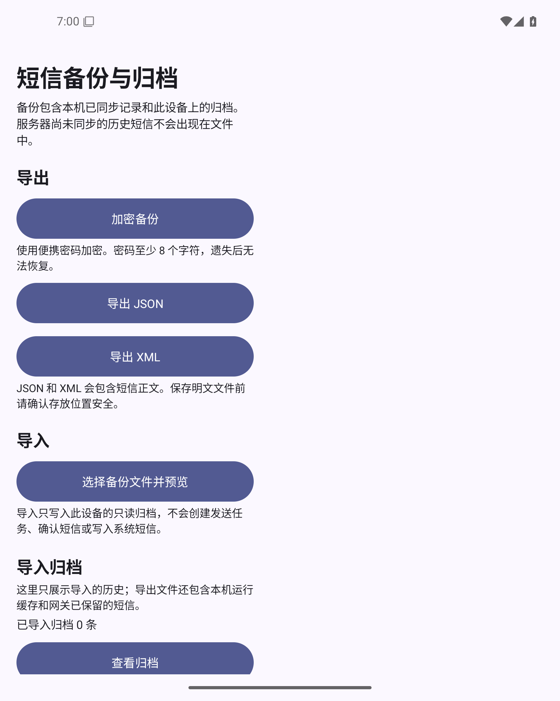

主机 App：主机 App：折叠后的备份界面。
仓库原图：`images/host-cb84cb2cf571-backup-folded.png`（SHA-256：`cb84cb2cf571fa5e19efd1295f084144f199c89bc818a3a2a262053c81bf04d7`）

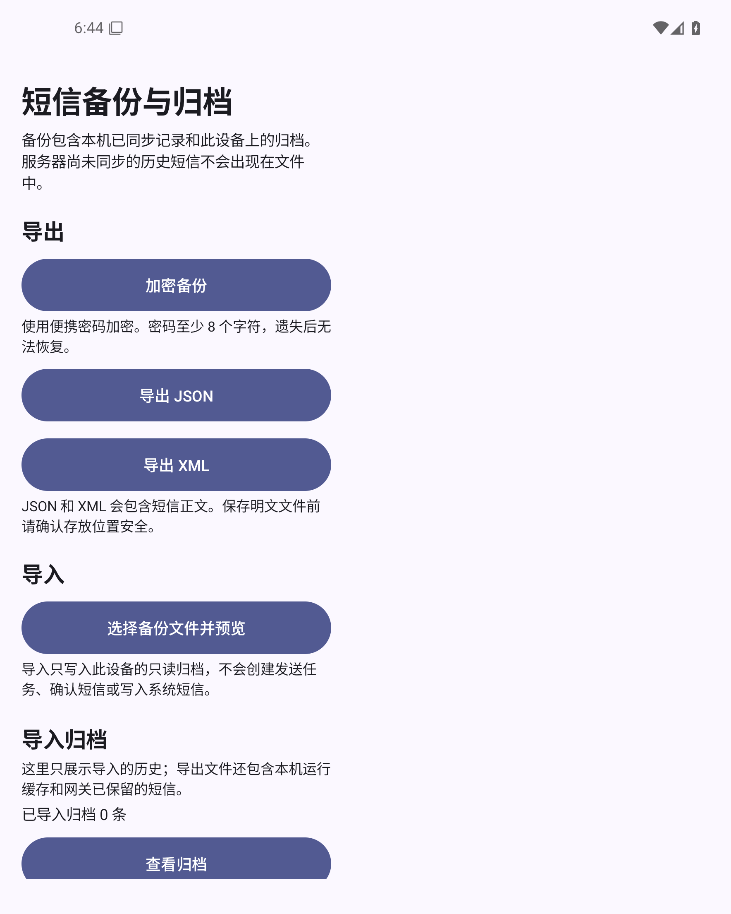

网关 App：网关 App：折叠后的备份界面。
仓库原图：`images/gateway-36363fa238ba-backup-folded.png`（SHA-256：`36363fa238badcd37d9f03d1424b00f4208f52c53ca78880afe9d64b086c857e`）

### 展开后的备份界面

恢复 OPENED 状态后，备份页面保持可操作；系统栏与打孔安全区域由同次运行检查。

主机 App：主机 App：展开后的备份界面。
仓库原图：`images/host-60f457ffd5a1-backup-unfolded.png`（SHA-256：`60f457ffd5a15ab696fca4c9c4912474658ee3d923276388b97ce5c76ec106d4`）

网关 App：网关 App：展开后的备份界面。
仓库原图：`images/gateway-047edd0740b7-backup-unfolded.png`（SHA-256：`047edd0740b7755ac3a5b3283dfa72c3ea0a839038914cf6a1e2cd062974ed84`）

### 网关本机短信保留

开关默认关闭；开启后在运行队列正文清除前保存独立历史副本。旧版本已经清除的正文无法通过开关恢复。

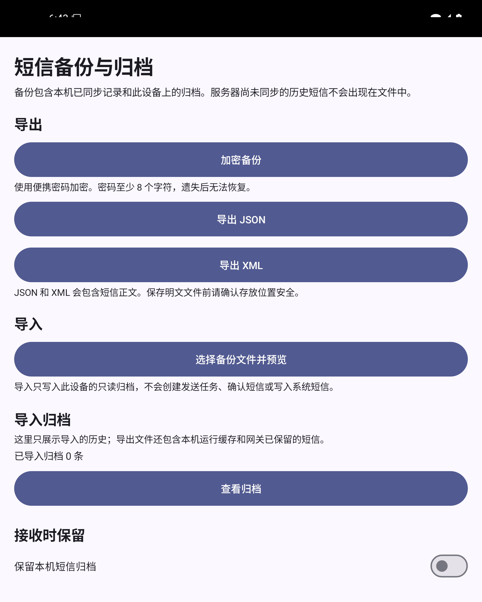

网关 App：网关的本机短信归档保留开关。
仓库原图：`images/gateway-c268a5b7261c-backup-retention.png`（SHA-256：`c268a5b7261c86acda30267e0a52e4e0f0a6a18333527373b1b60838a0fadbbf`）

## Magisk 模块运行验证

模块生命周期验证通过：全部 40/40 项检查通过，探针模块与 Gateway 模块安装、只读控制探测及启动钩子检查通过。 Magisk 30.7 / code 30700（检查详情记录的运行版本）；环境：官方 Magisk 环境初始化及冷启动后复核均通过；root access：adbd root; privileged actions via Magisk su -c。来源：workflow source commit 2d6f1565e91f71c9c9cb7d882def2ec33a4cef00；rootAVD commit 613caa44371f85e1a461bc030e07ddc2d71afe32；目标：system-images/android-34/google_apis/x86_64，x86_64；已观察 boot_id：[5fb0ab63-0c79-4be9-a4ae-0ed9491a620e, a7e7c944-abf2-4519-b8bb-e8995e87e3f9, 87bc2a8c-5526-4b70-8255-7ada4d87507d, 54da32f1-be89-485e-8709-7d9a32e1c069, f3240a2e-db59-4c92-8e8d-9e17dc37ddef]；模块标记 boot_id：[54da32f1-be89-485e-8709-7d9a32e1c069, f3240a2e-db59-4c92-8e8d-9e17dc37ddef]；workflow run 37273307094（https://github.com/KiriKira/gsm2sip/actions/runs/37273307094）。该结果只覆盖 disposable Android Emulator 的模块安装、启动钩子和只读控制探测，不代表 SIM、蜂窝音频、真实 SIP 通话或实体设备验收。Broker account query：gateway_broker_probe 检查记录=PASS；broker.status=ok；broker.count=1；broker.query_completed=True；account query 结果=PASS。范围：API 34 Emulator 上经 gsm2sipctl accounts 0 发起的只读 Android telephony account query；只记录账户数量，不保留账户标识；不证明真实 SIM/HAL、蜂窝音频或通话验收。
